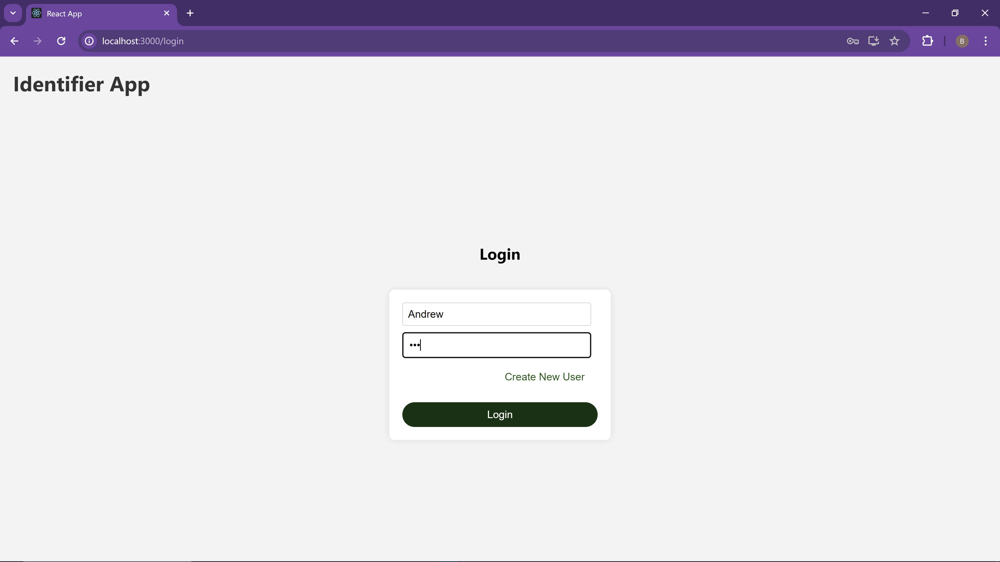

# EC530_ML

## Overview
This is a DIY ML web app that allows you to upload data to create your own object identification model.

## Walkthrough
Login page with option to create a new user

You create a new user on register page with username, password, and email

You can then login with your details

This pages list your projects, so make a new one

Projects are then shown on the page

Click on a project to get to project page where you can make a new model or test one you've made

Here we attach images to a model as the training data

Images added are shown and then we create the model

Once you create your model, you can test it by attaching a image for it to identify

## API's
- **Auth_api**
    - *new user*: POST
    - *login*: POST
    - *logout*: POST
    - *del user*: DELETE
- **data_upload_api**
    - *create project*: POST
    - *delete project*: DELETE
    - *get projects*: GET
    - *upload image*: POST
    - *get images*: GET
    - *delete image*: DELETE
    - *edit label*: PUT
- **training_api**
    - *start training*: POST
- **inference_api**
    - *post inference*: POST
    - *get results*: GET

## DATABASE
- **Users**
    - user_id
    - username
    - password
    - email
    - active
    - created_at
    - last_login
- **Projects**
    - project_id
    - user_id
    - name
    - created_at
    - updated_at
- **Images**
    - image_id
    - project_id
    - image
    - name
    - label
    - uploaded_at
- **Models**
    - model_id
    - project_id
    - model
    - uploaded_at
- **Inferences**
    - inference_id
    - model_id
    - image_path
    - result
    - inferred_at

## For Developers
Download React and Docker Desktop

In diyml/Client, run:
'''bash
npm start

In diyml/Backend, run:
'''bash
docker build -t "appname" .
docker run -p 5000:5000 "appname"
